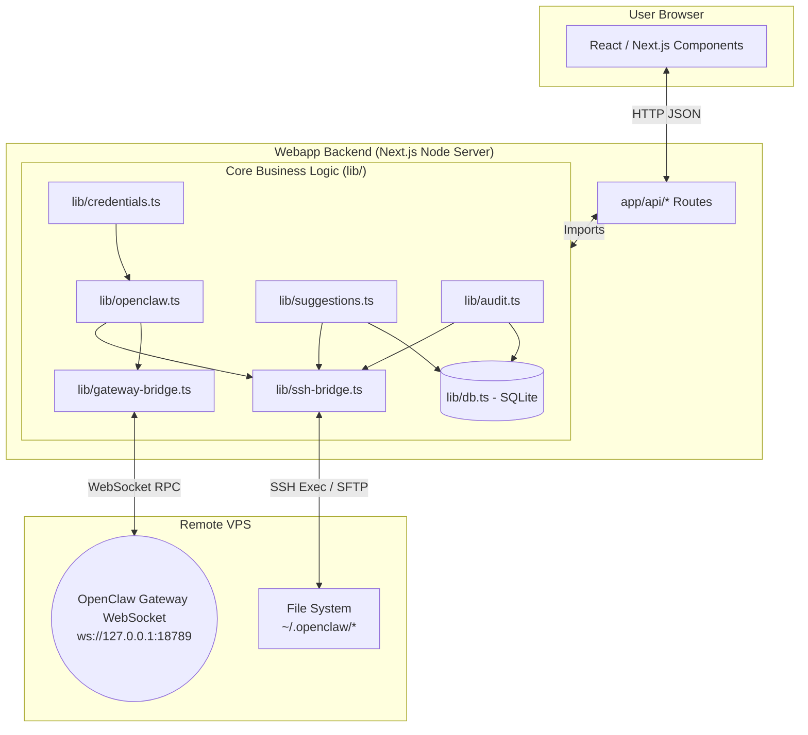
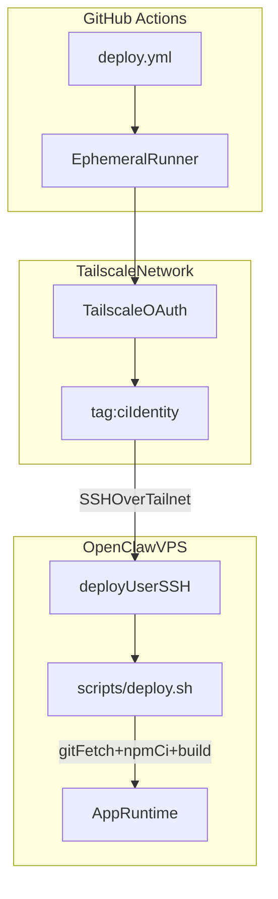
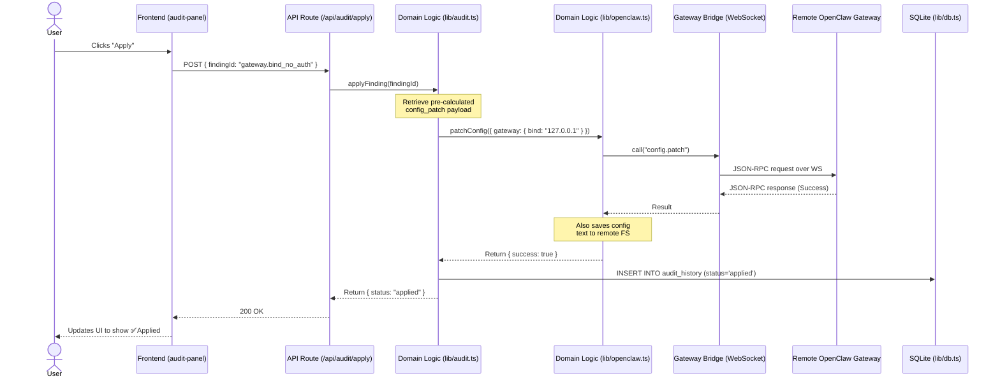

# OpenClaw Config Helper Architecture

This document describes the high-level architecture and data flows of the OpenClaw Config Helper application. The codebase is divided into three primary layers: the Next.js UI, the Next.js API Routes, and the core domain logic (`lib/`).

## System Overview & Topology

The application is built to run on the same local network as the OpenClaw Gateway (or via Tailscale) and interacts with the remote VPS through a combination of SSH and WebSocket connections.

## Deployment Control Flow (GitHub Actions + Tailnet)

Production deployments are automated through GitHub Actions and run over Tailscale rather than public internet ingress. The workflow joins the tailnet with a temporary CI identity and then executes the deploy script over SSH on the VPS.

### Deployment Sequence

1. Push to `main` triggers `.github/workflows/deploy.yml`.
2. Action runner joins tailnet using `tailscale/github-action` with OAuth credentials and `tag:ci`.
3. Runner verifies VPS reachability (`tailscale ping`) and opens SSH with strict host key checking.
4. Runner executes `scripts/deploy.sh <github.sha>` on the VPS.
5. Deploy script checks out exact commit, installs dependencies, builds, optionally restarts runtime, and optionally runs a health check.

### Trust Boundaries and Secrets

- GitHub stores `TS_OAUTH_*`, SSH key material, and host key pin as encrypted secrets.
- Ephemeral CI tailnet identity is constrained by ACLs (recommended: only SSH access to deploy target).
- VPS execution happens as a least-privilege deploy user, not root.
- Deployment script is idempotent and exits non-zero on failure so CI can block broken deploys.

## Directory Structure

### `app/` (Next.js App Router)

Handles the routing and server-side entry points.

- `**page.tsx**`, `**dashboard/**`, `**config/**`, `**audit/**`, `**credentials/**`, `**suggestions/**`: The frontend pages the user interacts with.
- `**api/**`: The backend HTTP endpoints serving the frontend. These routes are generally very thin and immediately call functions in `lib/`.

### `components/` (React UI)

The visual building blocks of the application.

- `**config-explorer.tsx**`: Renders the hierarchical tree view of `openclaw.json`.
- `**audit-panel.tsx**`, `**credentials-panel.tsx**`: UI for managing security findings and secrets.
- `**suggestions-panel.tsx**`: The feed of agent-driven recommendations.

### `lib/` (The "Black Box" - Core Business Logic)

This is where the actual mechanics of the application live.

#### 1. Communication Bridges

- `**ssh-bridge.ts**`: Maintains an SSH connection using the `ssh2` package. It provides `execCommand`, `readFile`, and `writeFile` functions. The app uses this to read files directly from the VPS (like the raw `openclaw.json` or `SUGGESTIONS.json`) and run terminal commands (like `chmod`).
- `**gateway-bridge.ts**`: Maintains a WebSocket connection to the OpenClaw Gateway (usually `127.0.0.1:18789`). This is used for real-time JSON-RPC calls, particularly `config.patch` which safely merges configuration changes.
- `**runtime-store.ts**` *(utility)*: Determines whether to use local file system APIs or `ssh-bridge.ts` to fetch files depending on the environment variable `OPENCLAW_ACCESS_MODE`.

#### 2. Domain Logic

- `**openclaw.ts*`*: The central brain for interacting with the OpenClaw configuration. It exposes functions to `loadConfig()`, `patchConfig()`, and `explainConfig()` (which annotates the raw JSON into human-readable summaries).
- `**audit.ts**`: Runs the security audit logic. It reads the active config and file permissions to surface vulnerabilities (e.g., world-readable config, gateway bound to public IP). Generates automatic patch payloads for remediation.
- `**credentials.ts**`: Scans the parsed configuration for plaintext secrets (like `sk-ant-*` or `ghp_*`). Provides logic to migrate these raw secrets into safer OpenClaw `SecretRef` providers (e.g., `$env:GITHUB_TOKEN`).
- `**suggestions.ts**`: Handles the use-case discovery engine. It reads `SUGGESTIONS.json` generated by the autonomous agent on the VPS, hydrates those suggestions with state stored in the local database (applied/saved/dismissed), and executes the payloads (config patches or shell commands) when the user clicks "Apply".

#### 3. State Management

- `**db.ts**`: Instantiates a local SQLite database using `better-sqlite3` in the `data/app.db` file. It tracks the state of the webapp that shouldn't be pushed to the VPS config, such as:
  - Which suggestions have been dismissed or saved.
  - A history of applied security audits.
  - Snapshots of the setup.

## Example Data Flow: Applying a Security Fix

When a user clicks "Apply" on a security finding (e.g., "Gateway bound beyond loopback"), the following sequence occurs:

1. **Frontend**: `audit-panel.tsx` sends a `POST /api/audit/apply` with the `findingId`.
2. **API Route**: `app/api/audit/apply/route.ts` receives the request and calls `applyFinding(findingId)` in `lib/audit.ts`.
3. **Domain Logic (`lib/audit.ts`)**: 
   - Retrieves the pre-calculated fix payload (which is a `config_patch` object changing `{ gateway: { bind: "127.0.0.1" } }`).
   - Calls `patchConfig()` in `lib/openclaw.ts`.
4. **Bridge (`lib/openclaw.ts` & `lib/gateway-bridge.ts`)**:
   - `patchConfig()` computes the new configuration and sends a `config.patch` JSON-RPC call over the WebSocket bridge to the live OpenClaw Gateway.
   - It also saves the new configuration text to the remote file system as a fallback/record.
5. **Database (`lib/db.ts`)**: `lib/audit.ts` logs that the finding was fixed in the SQLite database so the UI marks it as "Applied".
6. **Frontend**: The API responds with success, and the React UI updates the finding card to show a green checkmark.

